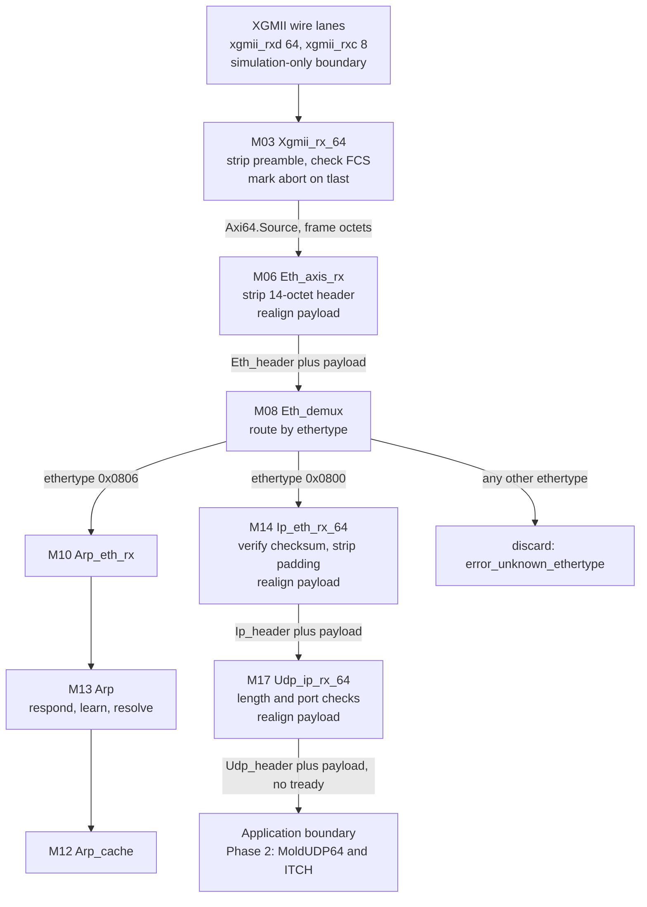
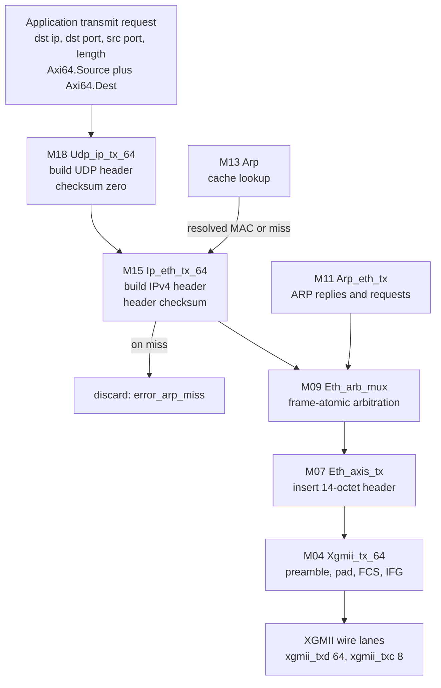
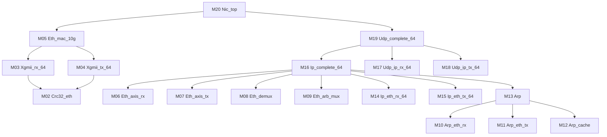

# Phase-1 Architecture — XGMII 10G MAC + ARP/IPv4/UDP

- **Status**: DRAFT — candidate for `P1-spec-freeze`
- **Owner**: architect_docs_lead · **Work order**: WO-0002
- **Companion documents**: [`requirements.md`](requirements.md) (REQ-###),
  [`traceability.md`](traceability.md), [`SPEC-TEMPLATE.md`](SPEC-TEMPLATE.md)
- **Decision context**: `docs/adr/ADR-0001` (programme scope), `ADR-0004`
  (Hardcaml v0.17.x), `ADR-0005` (CI is the authoritative build environment)

This document is the **canonical statement of Phase-1 scope parameters** from
M1 onward (PROTOCOL §11). README's phase table and the charters restate these
values for convenience; a change to any of them updates this file *and* every
restatement, under an ADR.

---

## 1. Scope parameters (canonical)

| Parameter | Value |
|---|---|
| Datapath width | 64 bits |
| Clock | one domain, nominally 156.25 MHz, 6.4 ns per cycle |
| Line rate | 10.0 Gb/s (8 octets per 6.4 ns) |
| Hardware attach point | XGMII, simulation-only in Phase 1 |
| Protocols in scope | Ethernet II framing, CRC-32 FCS, IFG, ARP, IPv4, UDP |
| Maximum frame | 1518 octets, destination address through FCS; no jumbo, no VLAN |
| Receive discipline | cut-through, zero backpressure |
| Receive latency budget | 24 cycles (153.6 ns), XGMII start word to first application payload word |
| Toolchain | released Hardcaml v0.17.x (ADR-0004), built and tested in CI (ADR-0005) |
| Differential reference | alexforencich/verilog-ethernet (MIT) |
| Out of scope | PMA/PCS/serdes (Phase 3), MoldUDP64/ITCH/order book (Phase 2) |

**Datapath arithmetic, stated once.** A minimum-length frame occupies 8 octets
of preamble and SFD, 64 octets of frame (destination address through FCS), and
at least 12 octets of inter-frame gap: 84 octets, or 10.5 cycles.

The inter-frame gap is measured **from the terminate character inclusive** to
the next start character exclusive, minimum 12 octets — one convention, stated
normatively in `requirements.md` §0.3 and used identically there, in REQ-004 and
in REQ-204. This is the convention that reproduces IEEE 802.3's 84-octet
minimum-frame budget (14.88 Mpps) unchanged from 1 Gb/s, where there is no
terminate character and all 12 gap octets are idle. Counting twelve *idle*
octets *after* the terminate character instead would make the minimum spacing
88 octets and would under-drive every line-rate stress bench by 4.5 %.

XGMII start characters may occupy lane 0 or lane 4, so 84 octets is exactly
realisable by alternating the start lane, and a compliant link partner — one
using the deficit idle count of IEEE 802.3 clause 46 to hold its *average* gap
at 12 octets — can therefore deliver minimum-length frames every 10 and 11
cycles alternately. **The receive path is designed for that arrival rate**
(REQ-004). The Phase-1 transmitter is deliberately simpler: deficit idle count
is out of scope and it starts frames on lane 0 only, so it rounds every gap up
to the next lane-0 boundary (16 octets from the terminate character inclusive)
and emits one minimum-length frame per 11 cycles (REQ-204, REQ-209). That
under-uses the link; it does not violate the standard, because a gap is never
shortened below 12.

---

## 2. Architectural decisions

Each decision below is stated with the alternative that was rejected. The
decisions marked *ADR candidate* are the ones whose reversal would be a
breaking interface change; they are extracted into `docs/adr/` before or at
`P1-spec-freeze`.

### 2.1 Cut-through receive path with late abort (*ADR candidate*)

The receive path forwards every payload word as soon as it is decoded. Frame
validity — FCS, length, error characters — is only known at the end of the
frame, so it is signalled **after** the payload has already been delivered, as
`tuser`[0] = 1 on the word carrying `tlast` (REQ-007, REQ-013, REQ-104). Every
downstream module propagates that bit; the application must treat a frame as
speculative until it sees `tlast`.

*Rejected*: store-and-forward, where each stage buffers a whole frame and only
emits validated frames. It is simpler to consume and it is what a general
purpose NIC does, but it costs at least a full frame time of latency
(1500 octets = 188 cycles = 1.2 µs) at every stage, which contradicts the whole
point of the programme. The cost of the choice is real and is pushed onto
Phase 2: the ITCH feed handler must be able to discard work it has already
started. REQ-019 (no payload buffer deeper than two words) exists so this
decision cannot quietly erode during implementation.

### 2.2 No backpressure anywhere on the receive path (*ADR candidate*)

Receive-path ports carry `Axi64.Source` records only. There is no `tready` to
assert, so there is no receive queue, no queue overflow condition, and no
possibility of the transmit path stalling the receive path (REQ-003, REQ-112,
REQ-208). The obligation this creates is placed explicitly on the consumer,
including the Phase-2 feed handler (REQ-805).

*Rejected*: full AXI-Stream with `tready` on the receive path, with elastic
buffers. That is the conventional choice and it tolerates a slow consumer, but
it makes "did we drop a frame" a runtime question rather than a structural
guarantee, and every buffer added is latency and an untested overflow path.
Making the absence of `tready` visible in the *type* is what makes REQ-003
mechanically checkable: a receive module that wants backpressure cannot be
written without changing its interface record, which is a spec diff.

### 2.3 Stream types come from `hardcaml_axi` (*prerequisite, see §7*)

The fabric type is `Hardcaml_axi.Stream.Make` instantiated once, programme
wide, as `Axi64` with `data_bits = 64` and `user_bits = 1`. That functor yields
`Axi64.Source` = { `tvalid`; `tdata`; `tkeep`; `tstrb`; `tlast`; `tuser` } and
`Axi64.Dest` = { `tready` }. Receive ports use `Source` alone; transmit ports
use `Source` plus `Dest`. `tstrb` is not used by this design and is driven to
zero (REQ-014).

*Rejected*: a local hand-written stream record without `tstrb`. It would be a
slightly tighter fit — eight fewer tied-off bits at every module boundary — but
it duplicates a Jane Street interface the charter names explicitly, and the
saving is cosmetic. **Prerequisite**: `hardcaml_axi` (which pulls
`hardcaml_circuits` and `hardcaml_handshake`) is *not yet* in
`agentic_fpga.opam`; adding it is an orchestrator action (§7). If it cannot be
installed in CI, the fallback is the local record and that reversal needs an
ADR, not a quiet edit.

### 2.4 Module decomposition mirrors verilog-ethernet

The inventory in §4 is aligned name-for-name with the 64-bit modules of
alexforencich/verilog-ethernet, because Phase-1 sign-off requires differential
co-simulation against it (REQ-901, dv_lead charter §3): matching boundaries
means the comparison can be made at each module, not only at the top.

*Rejected*: a decomposition organised by protocol layer as one module per layer
(one "ethernet" module, one "ip" module, one "udp" module). Fewer modules to
spec, but each becomes a large state machine with a mixed receive/transmit
concern, and the differential comparison degrades to a single top-level
equivalence check with no localisation when it fails.

Deliberate deviations from the reference are listed in §5.

### 2.5 ARP is a full resolver, not a responder-only stub

ARP answers requests for the configured address, learns from observed packets,
serves transmit-side lookups from a cache, and issues requests on a miss, with
special handling for broadcast, subnet-broadcast, multicast and off-subnet
destinations (REQ-501 … REQ-512). On a cache miss the pending datagram is
*discarded*, never queued (REQ-505) — the no-buffering rule wins over
convenience.

*Rejected (a)*: responder-only ARP with a statically configured peer MAC for
transmit. It is enough for a receive-only market-data NIC — multicast MACs are
derived arithmetically (REQ-509) and need no ARP at all — but it leaves the
programme without a testable ARP cache, and ARP is named in the programme scope
(ADR-0001). *Rejected (b)*: the reference design's LRU cache with hashing.
Phase 1 uses a 16-entry direct-mapped cache with an exactly specified index
function (REQ-504) so that collision behaviour is a derivable test rather than
an emergent property; the LRU version is a Phase-2-or-later refinement if
anything ever needs it.

### 2.6 Filtering happens at IPv4 and UDP, not at the MAC

The Ethernet receive path is promiscuous (REQ-407); acceptance is decided by
IPv4 destination (REQ-604) and UDP destination port (REQ-704). This matches the
reference design's behaviour, which keeps co-simulation stimulus simple, and it
puts multicast group acceptance in the layer that actually knows about groups.

*Rejected*: a MAC-layer address filter. It would drop foreign traffic one stage
earlier, saving nothing in a simulation-only design, and it would introduce a
co-simulation divergence class on the very first stage.

### 2.7 The application transmit interface declares its length up front

The application supplies destination address, ports and payload length before
the first payload word (REQ-705). This is what lets IPv4 and UDP build their
headers without buffering (REQ-610, REQ-706).

*Rejected*: deriving the length by buffering the payload, as a
checksum-generating UDP transmitter must. That would put a store-and-forward
FIFO on the transmit path and is the reason UDP transmit checksums are zero in
Phase 1 (REQ-706), which RFC 768 permits for IPv4.

### 2.8 Single clock domain

Receive and transmit share one clock (REQ-001). Real XGMII has independent
receive and transmit clocks; the Phase-1 design is simulation-only at that
boundary (REQ-018), so a second domain would add CDC structures that verify
nothing about the design under test.

*Rejected*: two domains with an asynchronous FIFO at the boundary. Deferred to
whatever future work attaches real hardware; that work owns the CDC.

---

## 3. The XGMII boundary and its stub

Phase 1 is **closed at XGMII** (REQ-017). The top level's only wire-side ports
are `xgmii_rxd`[63:0], `xgmii_rxc`[7:0], `xgmii_txd`[63:0], `xgmii_txc`[7:0].
Everything below XGMII — PMA, serdes, 64b/66b PCS, scrambler, link training,
fault signalling — is out of scope (REQ-018, REQ-113) and is where the Phase-3
stretch goal would attach.

The **stub** is the simulation-side link partner: a model that encodes frames
into XGMII lanes (preamble, start lane selection, terminate placement, idle
fill, error injection) and decodes them back. It is **owned by dv_lead under
`test/`**, not by the RTL line — it is stimulus, not design. This architecture
document fixes only its contract:

- It SHALL be able to emit start characters in lane 0 and lane 4, including the
  alternating pattern required by REQ-004.
- It SHALL be able to inject each error condition named in REQ-104, REQ-105,
  REQ-107, REQ-108 and REQ-110.
- It SHALL decode transmit-side XGMII well enough to validate preamble, FCS,
  terminate placement and inter-frame gap (REQ-201 … REQ-205).

These three clauses are restated inside REQ-018 so the stub's contract is
citable from `requirements.md` alone; the two statements must change together.

Because the RTL side is closed at XGMII, no RTL deliverable in §4 depends on
the stub's internals, and the stub can be replaced by the verilog-ethernet
reference driver for co-simulation (REQ-901).

---

## 4. Module inventory

Every Phase-1 RTL deliverable appears here. Modules live under
`libs/hardcaml_ethernet/src/` (rtl_lead's write scope); the emitted Verilog
module name is the snake-case module name (REQ-808). "Path" is R for the
receive datapath, T for transmit, S for shared or structural.

The Path column is descriptive. The **normative** definition of "receive path" —
the module chain, the streams it covers, how a structural module's receive ports
are separated from its transmit ports, and the by-name list of modules owing a
line-rate stress bench (M03, M06, M08, M10, M14, M17, M20) — is
`requirements.md` §0.4, so that a tb_writer holding only a REQ excerpt can
enumerate the obligation without this document.

| # | Module | Path | Role | verilog-ethernet counterpart | Primary REQs |
|---|---|---|---|---|---|
| M01 | `Axi64` | S | Programme stream types: `Hardcaml_axi.Stream.Make` at 64 bits, plus the `Xgmii` lane-pair record, the `Eth_header`, `Ip_header`, `Udp_header` records and `Config`/`Status`. Types only, no circuit. | (none — Verilog uses flat ports) | 010, 011, 012, 013, 014, 017, 802 |
| M02 | `Crc32_eth` | S | Combinational CRC-32 update for 1 to 8 octets per cycle. | `lfsr.v`, `axis_eth_fcs_64.v` | 301–306 |
| M03 | `Xgmii_rx_64` | R | XGMII lanes to frame stream: start-lane detection, preamble strip, terminate handling, FCS check, error marking. | `axis_xgmii_rx_64.v` | 101–113 |
| M04 | `Xgmii_tx_64` | T | Frame stream to XGMII lanes: preamble, padding, FCS append, terminate, inter-frame gap, underflow. | `axis_xgmii_tx_64.v` | 201–210 |
| M05 | `Eth_mac_10g` | S | Structural wrapper binding M03 and M04 to one XGMII port pair. | `eth_mac_10g.v` | 017, 018, 808 |
| M06 | `Eth_axis_rx` | R | Frame stream to Ethernet header record plus payload stream; realignment after the 14-octet header. | `eth_axis_rx.v` | 401–403, 407–410, 021 |
| M07 | `Eth_axis_tx` | T | Ethernet header record plus payload to frame stream. | `eth_axis_tx.v` | 405, 409 |
| M08 | `Eth_demux` | R | Ethertype routing: IPv4, ARP, discard. | `eth_demux.v` | 404 |
| M09 | `Eth_arb_mux` | T | Frame-atomic two-port arbitration between ARP and IPv4 transmit traffic. | `eth_arb_mux.v` | 406 |
| M10 | `Arp_eth_rx` | R | ARP packet parse into fields. | `arp_eth_rx.v` | 501 |
| M11 | `Arp_eth_tx` | T | ARP fields to packet. | `arp_eth_tx.v` | 502 |
| M12 | `Arp_cache` | S | 16-entry direct-mapped IPv4-to-MAC cache with ageing. | `arp_cache.v` | 503, 504, 506 |
| M13 | `Arp` | S | ARP state machine: respond, learn, resolve, request, retry, special-address handling. | `arp.v` | 502, 505, 507–512 |
| M14 | `Ip_eth_rx_64` | R | IPv4 parse, validation, padding strip, payload realignment. | `ip_eth_rx_64.v` | 601–607, 611, 612, 021 |
| M15 | `Ip_eth_tx_64` | T | IPv4 header construction and checksum. | `ip_eth_tx_64.v` | 608–610 |
| M16 | `Ip_complete_64` | S | Structural wrapper: M08, M10–M13, M14, M15, M09 — the IPv4-with-ARP subsystem. | `ip_complete_64.v` (with `ip_64.v` folded in) | 807, 808 |
| M17 | `Udp_ip_rx_64` | R | UDP parse, length checks, port filter, payload realignment. | `udp_ip_rx_64.v` | 701–704, 707, 021 |
| M18 | `Udp_ip_tx_64` | T | UDP header construction from the application request. | `udp_ip_tx_64.v` | 705, 706, 709 |
| M19 | `Udp_complete_64` | S | Structural wrapper: M16, M17, M18 — the full stack below the application. | `udp_complete_64.v` (with `udp_64.v` folded in) | 708 |
| M20 | `Nic_top` | S | Phase-1 top: M05 plus M19, configuration and status aggregation, application streams. | (assembled from `eth_mac_10g` + `udp_complete_64` in the reference's examples) | 801–809, 006 |

**Latency budget allocation** against REQ-006 (24 cycles). Each module spec
pins its exact per-octet constant L; these are the ceilings the specs must fit
inside. This table is transcribed into `requirements.md` §1.1, where REQ-019
makes the ceilings normative and gives them a DV observable — a module's
constant is compared as its **word delay** ΔC = (L + h) / 8, with L the
per-octet latency and h the front offset of `requirements.md` §0.5. The two
copies must change together.

| Stage | Front offset h (octets) | Ceiling on ΔC (cycles) |
|---|---|---|
| `Xgmii_rx_64` | 8 (lane-0 start) / 12 (lane-4 start) | 4 |
| `Eth_axis_rx` | 14 | 3 |
| `Eth_demux` | 0 | 1 |
| `Ip_eth_rx_64` | 20 | 5 |
| `Udp_ip_rx_64` | 8 | 4 |
| Allocated | | 17 |
| Slack held by the architect | | 7 |

Slack is released only by a spec diff, so an over-budget module is a visible
decision rather than an accumulation.

The unit is ΔC and not floor(L / 8) because ΔC is the quantity that **adds up**:
each stage's input measurement event is the previous stage's first output word,
so 4 + 3 + 1 + 5 + 4 = 17 is a real cycle count on the wire and REQ-006's
budget minus the slack. Under floor(L / 8) the same five numbers permitted a
chain of 24 cycles at a lane-0 start and 25 at a lane-4 start — the whole
budget or more — while every module individually passed REQ-019. That is
carry-forward C-1, raised by dv_lead in the WO-0005 re-review and resolved
under WO-0008 by changing the unit and keeping the allocation; the sponsor
delegated the resolution to architect_docs_lead and dv_lead jointly on
2026-08-02.

---

## 5. Deliberate deviations from the reference decomposition

| Deviation | Reason |
|---|---|
| `ip_64.v` and `ip_complete_64.v` merged into M16; `udp_64.v` and `udp_complete_64.v` merged into M19 | The reference keeps two wrapper levels so that multiple IP and UDP clients can be arbitrated. Phase 1 has exactly one client, so the inner wrapper would be a pass-through. Co-simulation still pairs at the outer wrapper. |
| `ip_arb_mux.v`, `ip_demux.v`, `udp_mux.v`, `udp_demux.v` omitted | Same reason: one client, one port. Protocol filtering is a comparison inside M14 (REQ-607) and port filtering inside M17 (REQ-704). |
| `udp_checksum_gen_64.v` omitted | It requires buffering the payload; Phase 1 transmits a zero checksum instead (REQ-706, §2.7). |
| `axis_eth_fcs_insert.v` / `axis_eth_fcs_check.v` folded into M03 and M04 | The reference's 10G MAC also computes FCS inside the XGMII adapters; the standalone variants exist for its 1G paths. |
| `eth_mac_phy_10g*.v`, `xgmii_baser_*.v` omitted | Below the XGMII boundary (REQ-018); Phase-3 territory. |
| PTP ports omitted throughout | Out of scope (REQ-018). |
| Direct-mapped ARP cache instead of `arp_cache.v`'s LRU | §2.5. |

**Provenance and licensing.** The counterpart column and the deviations above
were derived from the source-file listing in the verilog-ethernet README and
from the module and parameter declarations of `axis_xgmii_rx_64.v` and
`axis_xgmii_tx_64.v` (repository `alexforencich/verilog-ethernet`, MIT, read
2026-08-01). What was taken is **decomposition and naming**: which modules
exist, what each is responsible for, and which configuration knobs matter for
co-simulation (`ENABLE_DIC`, `ENABLE_PADDING`, `MIN_FRAME_LENGTH`,
`PTP_TS_ENABLE`). No Verilog source was copied into this specification, and all
behaviour above is stated as requirements to be implemented from scratch in
Hardcaml. `Essenceia/Nasdaq-HFT-FPGA` (CC BY-NC, consult-only under PROTOCOL
§10) was **not** consulted for this work order; it has no Phase-1 relevance.

---

## 6. Dataflow

### 6.1 Receive path



### 6.2 Transmit path



### 6.3 Hierarchy



`Axi64` (M01) is a types module and appears in every port record rather than in
the instance hierarchy.

### 6.4 Connection table

The diagrams above are the topology in a form a person reads. This section is
the **same topology in a form a program reads**: one row per edge, at port
granularity, for every module in §4. The org's generated block diagram is
rendered from this table plus the `Interface` records in
`docs/specs/ifc_check/`, so its column syntax is fixed and is not to be
prettified:

```
| source.port | sink.port | type | class |
```

- **`source.port` / `sink.port`** — `M<nn>.<port>` for an inventory module, or
  one of three boundary pseudo-nodes: **`WIRE`** (the XGMII boundary, driven and
  decoded in Phase 1 by the DV link-partner model, REQ-018), **`APP`** (the
  application boundary, Phase 2's feed handler) and **`EXT`** (the configuration
  and status boundary — the bench or platform that drives `Config` and observes
  `Status`). Both cells are always backquoted and always contain exactly one dot.
- **`type`** — the OCaml type the edge carries: a record name from SPEC-M01 §4.1
  (`Axi64.Source`, `Axi64.Dest`, `Xgmii`, `Eth_header`, `Ip_header`,
  `Udp_header`, `Config`, `Status`), a batch-D/E/F record, or `bit` / `bit[n]`
  for a scalar.

  **Where the batch-D records live** (settled by WO-0014). SPEC-M01 is FROZEN at
  f78766e, so a record added to its §4.1 would be a breaking post-freeze
  interface change and would invalidate the compile evidence five freeze records
  cite (SPEC-TEMPLATE rule 7). Batch D therefore declares each new record
  **once, in the specification of the module that owns it**, and every
  counterpart opens that module: `Arp_packet` in SPEC-M10 §4.1;
  `Arp_cache_query`, `Arp_cache_result` and `Arp_cache_write` in SPEC-M12 §4.1;
  `Arp_query` and `Arp_response` in SPEC-M13 §4.1. Batches E and F follow the
  same rule for their own records. SPEC-M10 §11.2 tracks promoting them into
  M01 if a later phase reopens it — a rename, not a behavioural change.
- **`class`** — exactly one of **`rx`** (an edge on requirements.md §0.4's
  receive datapath, carrying frame octets or a header record travelling with
  them), **`tx`** (the same on the transmit datapath), **`control`**
  (configuration fan-out, the ARP lookup and cache accesses, and the
  combinational CRC calls — signalling that is not a stream), **`status`** (a
  strobe).

**M01 `Axi64` appears in no row.** It is types-only: it has no ports, so it has
no edges (§6.3, REQ-808). Every other module appears, and the type column is
where M01 is present in every row of the table.

**M02 `Crc32_eth` appears twice**, once for its instance inside M03 and once for
its instance inside M04. Its four rows per instance are the one place this table
names an *internal signal* rather than a module port on one side: `M03.crc_*`
and `M04.crc_*` are the running-CRC register and its update path (SPEC-M03 §6.1,
SPEC-M04 §6.1), not ports of M03 or M04. They are tabulated because M02 is an
inventory module and a table that omitted it would be missing a node; a renderer
should draw one `M02` box with edges from both parents.

**M13 `Arp` does the same for its three children**, and batch D confirms it
rather than leaving a reader to infer it. M13 contains M10, M11 and M12 (§6.3),
so the M13 endpoints of the edges to and from them — `M13.arp_rx`,
`M13.arp_tx`, `M13.arp_tx_ready`, `M13.cache_query`, `M13.cache_result`,
`M13.cache_write` — are **internal signals of M13's hierarchy and not ports of
M13**: they appear in neither `I` nor `O` of SPEC-M13 §4.1, which says so in the
lift's own comment. The M13 endpoints that *are* ports — `rx_hdr`,
`rx_payload`, `tx_hdr`, `tx_payload`, `tx_payload_dest`, `tx_query`,
`tx_response`, the four `cfg_` scalars and the three strobes — appear there. The
same distinction will apply to M16 and M19 when batches E and F write them.

**What is enumerated and what is summarised.** §6.4.1 and §6.4.2 contain **one
row per port-level edge** of the receive and transmit datapaths — every edge of
§6.1 and §6.2, expanded through the wrapper levels §6.3 implies, with no
omissions. §6.4.3 enumerates every control edge the same way. §6.4.4 is the one
place this table **summarises**: it carries one row per strobe at the module that
*raises* it and one row for the top-level aggregation, and does **not** enumerate
the wrapper hops between them, because every wrapper relays every strobe of its
children unchanged and by name (SPEC-M05 §6.1 states it for M05; each wrapper
spec states it for itself, and requirements.md §12 fixes the names). A renderer
that wants the intermediate hops computes them from §4's containment and this
rule. The summary is stated so that nobody mistakes it for the whole.

**Provisional rows.** A row whose two endpoints are both specified modules —
M01 through M09, plus the `WIRE` and `EXT` boundaries — names ports that exist
in a written §4.1 today. A row naming a module from batches D–F (M10 … M20) is
**provisional in its port names only**: the edge itself and its type are fixed by
§6.1 and §6.2 and are not negotiable, while the port name is this document's
proposal. Each later batch's specification confirms or amends its own rows **in
the same commit** as the spec, exactly as SPEC-TEMPLATE §10 requires of the
traceability matrix — a batch that renames a port here and nowhere else has
broken the generated diagram, and a batch that renames it in §4.1 only has made
this table lie.

**Batch D's confirmation (WO-0014).** SPEC-M10 … SPEC-M13 confirm every row
naming M10, M11, M12 or M13 **unchanged in its port names**, with exactly one
amendment: the transmit table gains

> `| `M11.arp_ready` | `M13.arp_tx_ready` | `bit` | tx |`

because the `Arp_packet` M13 offers M11 has **no payload stream travelling with
it** — M11 generates the payload — so ADR-0008's acceptance event (the
acceptance of the frame's first payload word) has no instance at that port and
M11 exposes an explicit `arp_ready` instead. SPEC-M11 §7 states the substitution
and SPEC-M11 §11.3 flags it for dv_lead's countersignature. No other batch-D
port name moves, and the four `cfg_` scalars, the three ARP strobes and every
stream edge stand exactly as §6.4.1 … §6.4.4 wrote them before the specs
existed.

**117 edges: 26 `rx`, 40 `tx`, 29 `control`, 21 + 1 `status`.**

### 6.4.1 Receive datapath — class `rx` (26 edges)

| source.port | sink.port | type | class |
|---|---|---|---|
| `WIRE.xgmii_rx` | `M20.xgmii_rx` | `Xgmii` | rx |
| `M20.xgmii_rx` | `M05.xgmii_rx` | `Xgmii` | rx |
| `M05.xgmii_rx` | `M03.xgmii_rx` | `Xgmii` | rx |
| `M03.rx` | `M05.rx` | `Axi64.Source` | rx |
| `M05.rx` | `M19.rx` | `Axi64.Source` | rx |
| `M19.rx` | `M16.rx` | `Axi64.Source` | rx |
| `M16.rx` | `M06.rx` | `Axi64.Source` | rx |
| `M06.hdr` | `M08.hdr` | `Eth_header` | rx |
| `M06.payload` | `M08.payload` | `Axi64.Source` | rx |
| `M08.arp_hdr` | `M13.rx_hdr` | `Eth_header` | rx |
| `M08.arp_payload` | `M13.rx_payload` | `Axi64.Source` | rx |
| `M13.rx_hdr` | `M10.hdr` | `Eth_header` | rx |
| `M13.rx_payload` | `M10.payload` | `Axi64.Source` | rx |
| `M10.arp` | `M13.arp_rx` | `Arp_packet` | rx |
| `M08.ip_hdr` | `M14.hdr` | `Eth_header` | rx |
| `M08.ip_payload` | `M14.payload` | `Axi64.Source` | rx |
| `M14.hdr` | `M16.ip_rx_hdr` | `Ip_header` | rx |
| `M14.payload` | `M16.ip_rx_payload` | `Axi64.Source` | rx |
| `M16.ip_rx_hdr` | `M17.ip_hdr` | `Ip_header` | rx |
| `M16.ip_rx_payload` | `M17.ip_payload` | `Axi64.Source` | rx |
| `M17.hdr` | `M19.app_rx_hdr` | `Udp_header` | rx |
| `M17.payload` | `M19.app_rx_payload` | `Axi64.Source` | rx |
| `M19.app_rx_hdr` | `M20.app_rx_hdr` | `Udp_header` | rx |
| `M19.app_rx_payload` | `M20.app_rx_payload` | `Axi64.Source` | rx |
| `M20.app_rx_hdr` | `APP.hdr` | `Udp_header` | rx |
| `M20.app_rx_payload` | `APP.payload` | `Axi64.Source` | rx |

### 6.4.2 Transmit datapath — class `tx` (40 edges)

| source.port | sink.port | type | class |
|---|---|---|---|
| `APP.tx_request` | `M20.app_tx_request` | `Udp_tx_request` | tx |
| `APP.tx_payload` | `M20.app_tx_payload` | `Axi64.Source` | tx |
| `M20.app_tx_payload_dest` | `APP.tx_payload_dest` | `Axi64.Dest` | tx |
| `M20.app_tx_request` | `M19.app_tx_request` | `Udp_tx_request` | tx |
| `M20.app_tx_payload` | `M19.app_tx_payload` | `Axi64.Source` | tx |
| `M19.app_tx_payload_dest` | `M20.app_tx_payload_dest` | `Axi64.Dest` | tx |
| `M19.app_tx_request` | `M18.request` | `Udp_tx_request` | tx |
| `M19.app_tx_payload` | `M18.payload` | `Axi64.Source` | tx |
| `M18.payload_dest` | `M19.app_tx_payload_dest` | `Axi64.Dest` | tx |
| `M18.ip_hdr` | `M16.ip_tx_hdr` | `Ip_header` | tx |
| `M18.ip_payload` | `M16.ip_tx_payload` | `Axi64.Source` | tx |
| `M16.ip_tx_payload_dest` | `M18.ip_payload_dest` | `Axi64.Dest` | tx |
| `M16.ip_tx_hdr` | `M15.hdr` | `Ip_header` | tx |
| `M16.ip_tx_payload` | `M15.payload` | `Axi64.Source` | tx |
| `M15.payload_dest` | `M16.ip_tx_payload_dest` | `Axi64.Dest` | tx |
| `M15.eth_hdr` | `M09.ip_hdr` | `Eth_header` | tx |
| `M15.eth_payload` | `M09.ip_payload` | `Axi64.Source` | tx |
| `M09.ip_payload_dest` | `M15.eth_payload_dest` | `Axi64.Dest` | tx |
| `M13.arp_tx` | `M11.arp` | `Arp_packet` | tx |
| `M11.arp_ready` | `M13.arp_tx_ready` | `bit` | tx |
| `M11.hdr` | `M13.tx_hdr` | `Eth_header` | tx |
| `M11.payload` | `M13.tx_payload` | `Axi64.Source` | tx |
| `M13.tx_payload_dest` | `M11.payload_dest` | `Axi64.Dest` | tx |
| `M13.tx_hdr` | `M09.arp_hdr` | `Eth_header` | tx |
| `M13.tx_payload` | `M09.arp_payload` | `Axi64.Source` | tx |
| `M09.arp_payload_dest` | `M13.tx_payload_dest` | `Axi64.Dest` | tx |
| `M09.hdr` | `M07.hdr` | `Eth_header` | tx |
| `M09.payload` | `M07.payload` | `Axi64.Source` | tx |
| `M07.payload_dest` | `M09.payload_dest` | `Axi64.Dest` | tx |
| `M07.tx` | `M16.tx` | `Axi64.Source` | tx |
| `M16.tx_dest` | `M07.tx_dest` | `Axi64.Dest` | tx |
| `M16.tx` | `M19.tx` | `Axi64.Source` | tx |
| `M19.tx_dest` | `M16.tx_dest` | `Axi64.Dest` | tx |
| `M19.tx` | `M05.tx` | `Axi64.Source` | tx |
| `M05.tx_dest` | `M19.tx_dest` | `Axi64.Dest` | tx |
| `M05.tx` | `M04.tx` | `Axi64.Source` | tx |
| `M04.tx_dest` | `M05.tx_dest` | `Axi64.Dest` | tx |
| `M04.xgmii_tx` | `M05.xgmii_tx` | `Xgmii` | tx |
| `M05.xgmii_tx` | `M20.xgmii_tx` | `Xgmii` | tx |
| `M20.xgmii_tx` | `WIRE.xgmii_tx` | `Xgmii` | tx |

### 6.4.3 Control — class `control` (29 edges)

| source.port | sink.port | type | class |
|---|---|---|---|
| `EXT.cfg` | `M20.cfg` | `Config` | control |
| `M20.cfg_rx_enable` | `M03.cfg_rx_enable` | `bit` | control |
| `M20.cfg_tx_enable` | `M04.cfg_tx_enable` | `bit` | control |
| `M20.cfg_ifg` | `M04.cfg_ifg` | `bit[8]` | control |
| `M20.cfg_local_mac` | `M13.cfg_local_mac` | `bit[48]` | control |
| `M20.cfg_local_mac` | `M15.cfg_local_mac` | `bit[48]` | control |
| `M20.cfg_local_ip` | `M13.cfg_local_ip` | `bit[32]` | control |
| `M20.cfg_local_ip` | `M14.cfg_local_ip` | `bit[32]` | control |
| `M20.cfg_local_ip` | `M15.cfg_local_ip` | `bit[32]` | control |
| `M20.cfg_subnet_mask` | `M13.cfg_subnet_mask` | `bit[32]` | control |
| `M20.cfg_gateway_ip` | `M13.cfg_gateway_ip` | `bit[32]` | control |
| `M20.cfg_multicast_group` | `M14.cfg_multicast_group` | `bit[32]` | control |
| `M20.cfg_multicast_enable` | `M14.cfg_multicast_enable` | `bit` | control |
| `M20.cfg_listen_port` | `M17.cfg_listen_port` | `bit[16]` | control |
| `M20.cfg_accept_all_ports` | `M17.cfg_accept_all_ports` | `bit` | control |
| `M20.cfg_ttl` | `M15.cfg_ttl` | `bit[8]` | control |
| `M03.crc_state` | `M02.crc_in` | `bit[32]` | control |
| `M03.crc_octets` | `M02.data` | `bit[64]` | control |
| `M03.crc_count` | `M02.octet_count` | `bit[4]` | control |
| `M02.crc_out` | `M03.crc_next` | `bit[32]` | control |
| `M04.crc_state` | `M02.crc_in` | `bit[32]` | control |
| `M04.crc_octets` | `M02.data` | `bit[64]` | control |
| `M04.crc_count` | `M02.octet_count` | `bit[4]` | control |
| `M02.crc_out` | `M04.crc_next` | `bit[32]` | control |
| `M15.arp_query` | `M13.tx_query` | `Arp_query` | control |
| `M13.tx_response` | `M15.arp_response` | `Arp_response` | control |
| `M13.cache_query` | `M12.query` | `Arp_cache_query` | control |
| `M12.result` | `M13.cache_result` | `Arp_cache_result` | control |
| `M13.cache_write` | `M12.write` | `Arp_cache_write` | control |

### 6.4.4 Status — class `status` (22 edges)

| source.port | sink.port | type | class |
|---|---|---|---|
| `M03.error_bad_fcs` | `M20.status_error_bad_fcs` | `bit` | status |
| `M03.error_bad_frame` | `M20.status_error_bad_frame` | `bit` | status |
| `M03.error_runt` | `M20.status_error_runt` | `bit` | status |
| `M03.error_oversize` | `M20.status_error_oversize` | `bit` | status |
| `M03.error_start_without_terminate` | `M20.status_error_start_without_terminate` | `bit` | status |
| `M04.error_underflow` | `M20.status_error_underflow` | `bit` | status |
| `M06.error_short_frame` | `M20.status_error_short_frame` | `bit` | status |
| `M08.error_unknown_ethertype` | `M20.status_error_unknown_ethertype` | `bit` | status |
| `M10.error_arp_unsupported` | `M20.status_error_arp_unsupported` | `bit` | status |
| `M13.error_arp_miss` | `M20.status_error_arp_miss` | `bit` | status |
| `M13.error_arp_reply_dropped` | `M20.status_error_arp_reply_dropped` | `bit` | status |
| `M14.error_ip_bad_header` | `M20.status_error_ip_bad_header` | `bit` | status |
| `M14.error_ip_bad_checksum` | `M20.status_error_ip_bad_checksum` | `bit` | status |
| `M14.error_ip_fragment` | `M20.status_error_ip_fragment` | `bit` | status |
| `M14.error_ip_not_for_us` | `M20.status_error_ip_not_for_us` | `bit` | status |
| `M14.error_ip_truncated` | `M20.status_error_ip_truncated` | `bit` | status |
| `M14.error_ip_bad_protocol` | `M20.status_error_ip_bad_protocol` | `bit` | status |
| `M14.error_ip_oversize` | `M20.status_error_ip_oversize` | `bit` | status |
| `M17.error_udp_bad_length` | `M20.status_error_udp_bad_length` | `bit` | status |
| `M17.error_udp_port` | `M20.status_error_udp_port` | `bit` | status |
| `M18.error_tx_length_mismatch` | `M20.status_error_tx_length_mismatch` | `bit` | status |
| `M20.status` | `EXT.status` | `Status` | status |

---

## 7. Prerequisites for `P1-spec-freeze`

These are outside the architect's write scope and are requested from the
orchestrator as work orders (charter §7):

1. **`hardcaml_axi` dependency** — add to `agentic_fpga.opam` and to the
   `libraries` field of `libs/hardcaml_ethernet/src/dune`. It pulls
   `hardcaml_circuits` and `hardcaml_handshake` and needs OCaml ≥ 5.1, which
   the CI switch already satisfies (`hardcaml_waveterm` requires 5.1).
   Blocking for §2.3; the fallback if CI cannot install it is a local stream
   record plus an ADR.
2. **`docs/specs/ifc_check/` dune wiring** — a scratch library whose sources
   are the Interface records lifted out of the module specs. The `.ml` contents
   are the architect's (inside `docs/**`); the `dune` stanza and its inclusion
   in the build are the orchestrator's. Charter §5 makes a green `ifc_check`
   build a freeze precondition, and ADR-0005 makes the CI run identifier the
   only acceptable evidence for it.
3. **dv_lead testability review** of `requirements.md` before the freeze
   checklist is opened, so objections land as spec diffs rather than as gate
   blockers.

---

## 8. Per-module specification plan

Twenty specifications, in dependency order, grouped into six batches. Each
batch is proposed as one work order — batching is the orchestrator's call, but
the ordering is not: a spec may only be written after the specs it depends on
are drafted, because the dependant reuses their interface records.

| Batch | Specs | Depends on | Note |
|---|---|---|---|
| **A** | M01 `Axi64`, M02 `Crc32_eth` | — | Establishes the fabric records every later spec quotes; the first `ifc_check` compile happens here. Prerequisite 7.1 must be resolved first. |
| **B** | M03 `Xgmii_rx_64`, M04 `Xgmii_tx_64`, M05 `Eth_mac_10g` | A | The hardest receive module (M03) is specified early on purpose: its constant-latency and start-lane behaviour set the pattern the rest follow. |
| **C** | M06 `Eth_axis_rx`, M07 `Eth_axis_tx`, M08 `Eth_demux`, M09 `Eth_arb_mux` | A, B | Introduces the header-record convention and the realignment obligation (REQ-021). |
| **D** | M10 `Arp_eth_rx`, M11 `Arp_eth_tx`, M12 `Arp_cache`, M13 `Arp` | C | Independent of the IPv4 datapath; can run in parallel with E if two spec work orders are in flight. |
| **E** | M14 `Ip_eth_rx_64`, M15 `Ip_eth_tx_64`, M16 `Ip_complete_64` | C, D | M16 is structural and is specified after its children. |
| **F** | M17 `Udp_ip_rx_64`, M18 `Udp_ip_tx_64`, M19 `Udp_complete_64`, M20 `Nic_top` | E | M20 pins the measured end-to-end latency (REQ-806) and the configuration record (REQ-802). |

Every spec follows [`SPEC-TEMPLATE.md`](SPEC-TEMPLATE.md) and is frozen only
with a green `ifc_check` build and a dv_lead testability countersignature.

**Currency (2026-08-02, WO-0014).** Batches **A** and **B** are **FROZEN at
f78766e** — CI `build` run 30729342467 green, dv_lead countersignature
`J-dv_lead-0005`. Batch **C** is **FROZEN at 508eea2** — CI `build` run
30733153172 green at f457efc, whose `docs/specs/ifc_check/` tree is
byte-identical to 508eea2's, dv_lead countersignature `J-dv_lead-0007`. Both are
transcribed in `docs/gates/P1-spec-freeze-checklist.md`. Batch **D** is drafted
(SPEC-M10 … SPEC-M13) and awaits its `ifc_check` run and dv_lead's
countersignature; it has confirmed its own §6.4 rows in the same commit, with
the one amendment §6.4 records. Batches **E** and **F** are unwritten, which is
why §6.4's rows naming M14 … M20 remain provisional in their port names and why
each of those batches confirms or amends its own rows in the same commit as its
specs.

---

## 9. Forward look (non-binding)

Phase 2 attaches at the application receive stream of M20: MoldUDP64 and ITCH
5.0 parsing consume `Axi64.Source` words with no `tready` (REQ-805), which is
why the realignment obligation (REQ-021) is specified as a general rule here
rather than as an ITCH-specific trick later — 36-to-50-octet ITCH messages
straddling 64-bit words are the same problem one layer up. Phase 3 attaches
below the XGMII ports of M20, replacing the DV stub with a 64b/66b PCS. Neither
imposes a requirement on Phase 1 beyond what is already stated.

---

## 10. References

- `alexforencich/verilog-ethernet` (MIT) — README source-file listing;
  `rtl/axis_xgmii_rx_64.v` and `rtl/axis_xgmii_tx_64.v` module and parameter
  declarations. Read 2026-08-01 as decomposition ground truth; no source
  copied.
- `janestreet/hardcaml_axi` v0.17.0 — `src/stream_intf.ml` (`Config`, `Source`,
  `Dest`, `Make`) and `hardcaml_axi.opam` (dependency and OCaml constraints).
- IEEE 802.3 clause 46 (XGMII), clause 4 (frame format, FCS, inter-frame gap);
  RFC 826 (ARP), RFC 791 (IPv4), RFC 768 (UDP), RFC 1112 §6.4 (IPv4 multicast
  MAC mapping).
- `docs/adr/ADR-0001`, `ADR-0004`, `ADR-0005`; `agents/PROTOCOL.md` §7, §10, §11.
